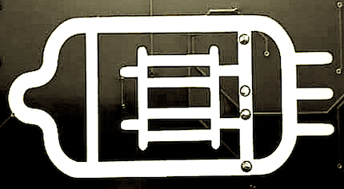

# $\Delta{_t}$ $-$ _Cheat-sheets:_ $\forall _{EE} \in\(\textbf{ Analog audio circuit design \)}$

Practical Design guides, Articles & Blog Posts as well as Online-Tools and Calculators

----

### Table of Contents:
_needs to be updated once a better document structure has evolved_

-----

## Design Tools & Online Calculators (components, parameters, layouts)
### Signal Chains
- [Signal Chain Designer (Analog Devices)](https://tools.analog.com/en/signalchaindesigner/)
  
### Filters
- [Filter Lab (Microchip)](https://filterlab.microchip.com/filter)
- [Analog Filter Wizard (Analog Devices)](https://tools.analog.com/en/filterwizard/)
- [Microstrip Filter Design Tool (Markimicrowave)](https://markimicrowave.com/technical-resources/tools/microstrip-filter-design-tool)
- [Butterworth vs. Chebyshev Bandpass Filter Response (Qorvo)](https://www.qorvo.com/design-hub/design-tools/interactive/butterworth-vs-chebyshev-bandpass-filter-response)
- [Image Rejection Calculator (Qorvo)](https://www.qorvo.com/design-hub/design-tools/interactive/image-rejection-calculator)
  
### Inductors / Transformers / (PSUs)
- [RF Impedance Matching Calculator (Analog Devices)](https://www.analog.com/en/resources/interactive-design-tools/rf-impedance-matching-calculator.html)
- [Complex Impedance Calculator (Fair-rite)](https://fair-rite.com/complex-impedance-calculator/)
- [Calculator Dashboard (Fair-Rite)](https://fair-rite.com/calculator-dashboard/) [note: various; impedence, toroid, power-handling, bobbin, rod-permeability]

### Power & Thermal
- [EE-Sim® Power Tools (Analog Devices)](https://www.analog.com/en/resources/design-tools-and-calculators/ee-sim.html)
  1. [EE-SIM Design and Simulation Environment (Analog Devices)](https://www.analog.com/media/en/technical-documentation/user-guides/eesim-design-and-simulation-environment-user-guide.pdf)
- [EE-Sim Solution Finder (Analog Devices)](https://tools.analog.com/en/eesim/)
- [Noise Figure Temperature (Qorvo)](https://www.qorvo.com/design-hub/design-tools/interactive/noise-figure-and-noise-temperature-calculator)
- [LTpowerCAD and LTpowerPlanner (Analog Devices](https://www.analog.com/en/lp/ltpowercad.html)
  1. [LTpowerCAD II Quick Start (Analog Devices)](https://www.analog.com/media/en/simulation-models/software-and-simulation/LTpowerCADIIQuickStart.pdf)
  2. [LTpowerPlanner III System-Level Design Tool Quick Start Guide](https://www.analog.com/media/en/technical-documentation/user-guides/ltpowerplanneriii_qsg.pdf)

### Signals, RF & Measurement
- [ADI Precison Studio (Analog Devices)](https://tools.analog.com/en/precisionstudio/)
- [RF Impedance Matching (Qorvo)](https://www.qorvo.com/design-hub/design-tools/interactive/rf-impedance-matching-calculator)
- [In-Amp Diamond Plot Tool (Analog Devices)](https://tools.analog.com/en/diamond/)
- [Calculating Transmitted Power Using Return Loss (Analog Devices) - ZIP File](https://www.analog.com/media/en/designtools/calculators/returnlossconversions.zip)
- [Calculating Equivalent Parallel Impedance (Analog Devices) - XLS File](https://www.analog.com/media/en/designtools/calculators/calcdiff.xls)
- [Precision DAC Error Budget Calculator (Analog Devices)](https://tools.analog.com/en/dacerrorbudget/)
- [Precision ADC Driver Tool (Analog Devices)](https://tools.analog.com/en/adcdriver/)

## Circuit Design, Simulation Software & PCB/SMT Manufacture Resources

### ECAD Software and Resources
- [KiCAD (Open Source)](https://www.kicad.org/)
- [EasyEDA (Vendor-bound)](https://easyeda.com/)
- [SnapEDA](https://www.snapeda.com/) [note: designs footprints and 3D objects for components in seconds]
- [Free Reader (Ultra Librarian)](https://www.ultralibrarian.com/products/free-reader/)
- [Samacsys Library Loader - ZIP File](https://componentsearchengine.com/LibraryLoader.php)

### Simulation Software & Measurement
[LTSpice and now QSpice are particularly suited for audio circuits due to the types of components, measurements and simulations they support. QSpice seems to add Macros/Programmability and an updated GUI & feature-set. Quite new but promising. Most of the industry doesn't use Ngspice and F/OSS Projects like Qucs are effectively dead. But "LiveSPICE" (see below) give a bit of hope for audio-tailored SPICE simulations as open-source. Practically all SPICE Programs that aren't F/OSS are free for public use and don't incurr cost on the end-user (apart from maybe a website registration). That being said: read the fine print when it comes to commercial product manufacture!]

- [SPICE](https://en.wikipedia.org/wiki/SPICE) [note: "Simulation Program with Integrated Circuit Emphasis"]
  1. [Ngspice](https://ngspice.sourceforge.io/) [note: most commonly used open-source version]
     * [Ngspice User’s Manual](https://ngspice.sourceforge.io/docs/ngspice-manual.pdf)
  2. [LTSpice (Aanalog Devices)](https://www.analog.com/en/resources/design-tools-and-calculators/ltspice-simulator.html) [note: most commonly used version in the industry]
     * [LTSpice Basics](https://www.analog.com/en/resources/media-center/videos/series/ltspice-basics-video-series.html)
  3. [QSpice (Qorvo)](https://www.qorvo.com/design-hub/design-tools/interactive/qspice) [note: new+promising, very similar to LTSpice, modernized, new featrues (incl. embedded C/C++ / Verilog), tools for simple component/param. import] 
  4. [LiveSPICE](https://www.livespice.org/) [note: interesting project, early days, says "a SPICE-like circuit simulation tool for live audio signals"]
  5. ~~[Qucs](https://qucs.sourceforge.net/) [note: seems to be no longer maintained (2017)]~~
  6. [QucsStudio](https://qucsstudio.de/) [note: fork of Qucs, not compatible]
  7. [MacSpice 3](https://www.macspice.com/)
     * [QuickStart Guide for QSPICE® Simulation Tool](https://www.qorvo.com/design-hub/videos/quickstart-guide-for-qspice-simulation-tool)
 - [dBm-Volts-Watts Conversion (Qorvo)](https://www.qorvo.com/design-hub/design-tools/interactive/dbm-volts-watts-conversion)
 - [Pad Attenuator (Pi, Tee, & Bridged-Tee) Calculator (Qorvo)](https://www.qorvo.com/design-hub/design-tools/interactive/pad-attenuator-calculator)

### PCB+Component Design: Evaluation, Testing, QA, Tools & various calcs. 
#### ADC/DAC + Analog-related small circuit design wizards
 - [Virtual Eval Tool (Analog Devices)](https://beta-tools.analog.com/virtualeval/)
   - [Precision ADC Driver Tool](https://tools.analog.com/en/adcdriver/)
   - [ADIsimDDS (Direct Digital Synthesis)](https://tools.analog.com/en/simdds/)
   - [Photodiode Circuit Design Wizard](https://tools.analog.com/en/photodiode/)
- [Cascade Analysis Calculator (Active / Passive) (Qorvo)](https://www.qorvo.com/design-hub/design-tools/interactive/cascade-calculator)
#### PCBA/SMT Layout, PnP, Panelizing, Manufacture
- [PCB Trace Power Handling Calculator (Qorvo)](https://www.qorvo.com/design-hub/design-tools/interactive/pcb-trace-power-handling-calculator)
- [PCB Panelization (JLCPCB)](https://jlcpcb.com/help/article/pcb-panelization)
  * [PCB Panelization Explained: Tips and Techniques (JLCPCB)](https://jlcpcb.com/blog/pcb-panelization-tips-and-techniques)
- [PCB Design For Manufacture Tutorial (EEVblog #127)](https://www.eevblog.com/2010/11/15/eevblog-127-pcb-design-for-manufacture-tutorial/)
- [DFM Automated PCB Panel Testing (EEVblog #552)](https://www.eevblog.com/2013/11/29/eevblog-552-dfm-automated-pcb-panel-testing/)
- [Unlocking PCB Thermal Management: Enhance with Thermal Relief Pads (LCSC)](https://www.lcsc.com/blog/unlocking-pcb-thermal-management/)
#### Housing & Front-panel Manufacture
1. [Lansig](https://www.lansing-enclosures.com/)
2. [CollectiveCases](https://collectivecases.com/)
3. [FrontPanels.de](https://shop.frontpanels.de/) [note: Frontpanels & Housings, customized]
4. [AudioPhonics.fr](https://www.audiophonics.fr/en/diy-enclosures-and-cases-c-6336.html)
5. Tube Town:
  + [Faceplaces (Tube Town)](https://www.tubetown.net/ttstore/en/faceplates/)
  * [Chassis (Tube Town)](https://www.tubetown.net/ttstore/en/chassis-shop/)
6. [JLC3DP](https://jlc3dp.com/3d-models/category/Enclosure) [note: also JLCCNC / PCB have front panel options and articles on the topic]
7. Aliexpress: search for shielded PCB housings and you'll find massive amounts, incl. custom engraved/drilled ones (often free) if you buy in bulk or at a higher quantity 

## Video Blogs (aka Youtube / Vimeo etc.) / Podcasts
### EEVBlog (Dave Jones)
[Deserves it's own mention right smack in the middle. I'll link the channel and over time specific videos on fundamentals and specific topics of interest (lab setup, PSUs, measurement, repair etc.)]
-  https://www.youtube.com/eevblog (https://www.eevblog.com)

## Online Forums & discussion portals on (analog) audio design/engineering
- **[GroupDIY](https://groupdiy.com/)** [note: a lot of OSHW projects, many DIY Kit designers provide support for a given Kit in their own threads, design questions, large builds, vintage research etc.]
   * "[GroupDIY Rules: Read before posting in any of the forums!](https://groupdiy.com/threads/groupdiy-rules-read-before-posting-in-any-of-the-forums.6650/)"
   * "[Meta-Meta: Look here for overview..](https://groupdiy.com/threads/meta-meta-look-here-for-overview.16013/)"
- **[diyaudio](https://www.diyaudio.com/community/)** [note: more focused on general audio engineering, some great DIY build write-ups (people building their own consoles etc.!)]

## Articles, Posts & References 
[from fundamentals to advanced design, production, manufacture and measurement]

### Open access to closed papers and books
[we shoudln't advertise this here, but it's the reality that access to many publications and journals outside of working at a university or being a student is not affordable, with a lot of basic textbooks costing multiple hundered USD and even old classics in EE often more than 80 EUR. Access to regular publications that makes economic sense is a completely different topic and, actually, far worse.]
- [Sci-Hub](https://sci-hub.se/)
- Google various "PDFDrive" sites for full engineering / topic specific books

### Various Articles, Posts, Talks
- [Harmonics - THD+N (NI)](https://www.ni.com/docs/en-US/bundle/rfmx-specan/page/harmonics.html)
- [Simple RF Circuit Design (Michael Ossman)](https://www.youtube.com/watch?v=TnRn3Kn_aXg)
    * [BlackHat Asia 2016: Rapid Radio Reversing (Michael Ossmann)](https://www.youtube.com/watch?v=8kIxlMIGctc) ([Paper](https://greatscottgadgets.com/tr/gsg-tr-2016-1.pdf))
- [An ultra low-distortion oscillator with THD below -140 dB](http://www.janascard.cz/PDF/An%20ultra%20low%20distortion%20oscillator%20with%20THD%20below%20-140%20dB.pdf) ([PCB/Finished Product](http://www.janascard.cz/aj_Vyrobky.html))
   * Going back to (AFAIK, please open an issue/write if I've been mislead): [Low-distortion Audio-range Oscillator - 2012/01 (diyaudio)](https://www.diyaudio.com/community/threads/low-distortion-audio-range-oscillator.205304/)

### ESP (Elliott Sound Products) - sound-au.com
1. [Elliott Sound Products - The Audio Pages](https://sound-au.com/articles/index.htm) [note: index, from very basics to advaced topics]
   *   [Beginners Guide](https://sound-au.com/articles/index.htm#begl) [note: recommended reading for new-comers!]
   *   [Electrical Safety](https://sound-au.com/articles/index.htm#safl) 
   *   [Components & Use](https://sound-au.com/articles/index.htm#comp) [note: good intro/description on component values, TH vs SMD]
   *   [Test & Measurement](https://sound-au.com/articles/index.htm#test)
   *   [General Information](https://sound-au.com/articles/index.htm#geni) [note: myths in audio(phile) non-sense etc. explained] 
   *   [Design Guidelines](https://sound-au.com/articles/index.htm#desi)
   *   [Power Supply Design](https://sound-au.com/articles/index.htm#psud) [note: worth reading up on; linear vs. switching (SMPS) in audio - background on: inrush currents, isolation, traffos etc.]
   *   [Amplification](https://sound-au.com/articles/index.htm#ampl) 
   *   [Cables](https://sound-au.com/articles/index.htm#cabl) [note: interconnects, coax, impedence, shielding, balanced vs. unbalanced etc.]
2. [ESP: **Valves / Tubes**](https://sound-au.com/valves/index.html) 
   *   [**Valves (Vacuum Tubes) - A Primer**](https://sound-au.com/valves/valveintro.html) [note: topic intro]
   *   [Valve Amplifiers](https://sound-au.com/hfr_be.htm)
   *   Valve (Vacuum Tube) **Amplifier Design Considerations**
        - [Part 1](https://sound-au.com/valves/design.html)
        - [Part 2](https://sound-au.com/valves/design2.html)
  *   [Valves / Tubes: **Preamps**](https://sound-au.com/valves/preamps.html)
  *   [Valves / Tubes: **Classes of Operation**](https://sound-au.com/valves/classes.html)
  *   [Valves / Tubes: **Biasing and Gain**](https://sound-au.com/valves/bias-gain.html)
  *   [Valves / Tubes: **Harmonic and Intermodulation Distortion**](https://sound-au.com/valves/thd-imd.html)
  *   [**Valve Stage Analysis**](https://sound-au.com/valves/analysis.html)
  *   [High Voltage DC Supply](https://sound-au.com/project151.htm) [note: design project. many projects have ready-to-order PCBs, check his site!]
3. [ESP Application Notes](https://sound-au.com/appnotes/index.html) [note: various. from converters, motors, detection circuits and analog meters to high-power zener diodes]

### "Fun with Tubes" (Max Robinson)
1. Index: [Fun With Tubes](https://www.angelfire.com/electronic/funwithtubes/)
2. Fundamentals
  - [DC Circuits Basics / Cheat-sheet](https://www.angelfire.com/electronic/funwithtubes/Basics_01_DC_Circs.html)
  - [AC Circuits Basics / Cheat-sheet](https://www.angelfire.com/electronic/funwithtubes/Basics_02_AC_Circs.html)
  - [Grounds](https://www.angelfire.com/electronic/funwithtubes/Grounds.html)
3. Vacuum Tubes
  - [Vacuum Diodes](https://www.angelfire.com/electronic/funwithtubes/Basics_03_Diodes.html)
  - [Vacuum Triodes](https://www.angelfire.com/electronic/funwithtubes/Basics_04_Triodes.html)
  - [Multi-grid Tubes](https://www.angelfire.com/electronic/funwithtubes/Basics_05_Multigrid.html)
4. Instruments / Lab Equipment
  - [Bench Power Supplies](https://www.angelfire.com/electronic/funwithtubes/bench_psu.html) [note: somewhat dated, but good theory. for SMPSs check EEVBlog and ESP/sound-au]

-------

  
    Written by: AZ (Aaron Zauner) <info@secondorderharmonics.eu> [@ 03..04/12/2025]
        © 2𝑓 — Second Order Harmonics (2025) » Analogue Sound for the Digital Age        
               Licensing: MIT License [see 'LICENSE'-File]. Only relating to this 
               git-repository, not any links or off-site information shared-within.
